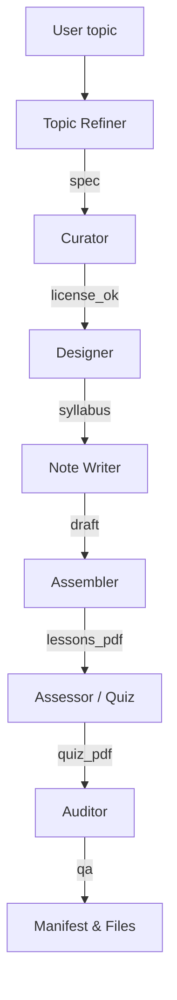

# curate2course

Agentic pipeline that turns a short topic prompt into a structured, multi‑week **OER** course: syllabus, lesson handouts, and quizzes — all exported as **PDFs** and JSON where appropriate. Built with **CrewAI** + **Gradio** + **ReportLab** + **Wikipedia**.

---

## ✨ What it does

- **Topic Refiner (AI agent):** reformulates a short or vague user topic into a **clear course spec** (title, scope, global objectives, keywords, ordered subtopics).
- **Curation + License gating:** searches open content (Wikipedia) and filters by **allowed licenses** (CC‑BY, CC‑BY‑SA, CC0, Public Domain).
- **Syllabus generation:** multi‑week, lesson‑sized plan (configurable weeks × lessons/week).
- **Lesson authoring:** for each lesson:
  - Overview + **Key Concepts** + **Core Content split into 3 axes** (e.g., Foundations, Practice, Implications; or derived section names like *History*, *Principles*, *Applications*).
  - **Self‑check** questions.
  - **Attribution** lines compliant with CC‑BY‑SA.
  - Exported to **Markdown** **and PDF** (proper bullet formatting).
- **Quizzes per lesson:** 5 MCQs + 1 short answer. Validated and exported as **JSON** + a nicely formatted **PDF**.
- **Manifest + QA:** a machine‑readable `course_manifest.json` and a minimal license QA report.
- **Progress UI:** a live **progress bar** and current task text (e.g., “Authoring lessons (3/8)”).

---

## 🧠 Agentic workflow (high level)



**Deterministic build** (post‑crew step): we then run a predictable, auditable builder that uses the refined topic + curated sources to generate the final PDFs/JSON. This ensures consistent output even if LLM calls vary.

---

## 🗂️ Output structure

```
course/
  syllabus.md
  syllabus.pdf
  syllabus.json
  reading_list.md
  reading_list.pdf
  lessons/
    week_1/lesson_1.md
    week_1/lesson_1.pdf
    ...
  quizzes/
    week_1_lesson_1.json
    week_1_lesson_1.pdf
    ...
  course_manifest.json
  qa_report.json
```

### Lesson PDF layout
- **Objectives** (bulleted, clean layout)
- **Overview** (short summary)
- **Key Concepts** (bulleted, up to 5 lines)
- **Core Content** split into **three axes** (sectioned H3 blocks)
- **Self‑Check** (numbered list)
- **Attribution**

---

## 🔧 Install

```bash
# Python 3.10+ recommended
python -m venv venv
venv\Scripts\activate  # (Windows)  or  source venv/bin/activate (macOS/Linux)

pip install -U pip wheel
pip install -r requirements.txt
# or the key libs:
pip install crewai gradio reportlab wikipedia
```

> **Note on Gradio versions:** we’ve seen a `gradio_client` JSON‑schema parsing error (`TypeError: argument of type 'bool' is not iterable`) with some combos. This repo includes a tiny **compatibility shim** that safely handles boolean schemas at runtime so the UI can boot reliably.

---

## ▶️ Usage

### CLI
```bash
python -m src.main build \
  --topic "Finance" \
  --weeks 4 \
  --lessons-per-week 2 \
  --min-resources 2 \
  --license-allowlist "CC-BY,CC-BY-SA,CC0,Public Domain"
```

### UI
```bash
python -m src.main ui
```
- Enter **Topic** (short prompt is OK).
- Choose **weeks**, **lessons per week**, **min resources**, and **allowed licenses**.
- Click **Build Course**. Watch the **progress bar** and **status** text.
- Download PDFs from the **Key files / Lessons / Quizzes** tabs.

---

## ⚙️ Configuration

- `configs/settings.yaml` — tune model choices, temperatures, etc. (optional).
- **Allowed licenses** can be set in the UI or via CLI flag `--license-allowlist`.

---

## 🏗️ How it works (files)

- `src/agents.py` — includes the **Topic Refiner** plus supervisor/curator/designer/note_maker/assessor/assembler/auditor.
- `src/tasks.py` — task prompts (incl. `t_refine`, the JSON‑strict course spec).
- `src/workflow.py` — the orchestration:
  - Runs `t_refine` first and uses its **keywords + subtopics** to guide curation.
  - Executes crew agents (hierarchical) then a **deterministic build** that writes PDF/JSON.
  - Ensures **unique lesson content** and **proper PDF formatting** (bullets, sections).
- `src/tools/export_tools.py` — Markdown→PDF + Quiz JSON→PDF formatting with ReportLab.
- `src/main.py` — CLI & Gradio UI. Includes a small **gradio_client** monkey‑patch to tolerate boolean JSON schemas that break API inspection on some installs.

---

## 🧪 Deterministic vs. Agentic

- **Agentic** (CrewAI): creative planning, decomposition, assessments.
- **Deterministic**: reproducible file writing, formatting, license gating, and stable structure.
- Benefit: **reliability** for artifacts + **intelligence** for planning.

---

## 🚧 Known limits & ideas

- Sources are currently **Wikipedia‑first** for OER compliance; add other OER catalogs later.
- PDFs are plain but clean; you can add themes/cover images easily in `export_tools.py`.
- Add an optional **LLM “sectionizer”** to convert raw text into MOOC‑style subsections (video + reading + activity) for an even richer layout.

---

## 📝 License

This codebase is provided under the MIT License. Generated content respects source licenses (e.g., CC‑BY‑SA). Always keep attributions in the lesson PDFs.

---

## 🙌 Credits

- CrewAI (agent orchestration)
- Gradio (UI)
- ReportLab (PDFs)
- Wikipedia (open content / CC‑BY‑SA)
