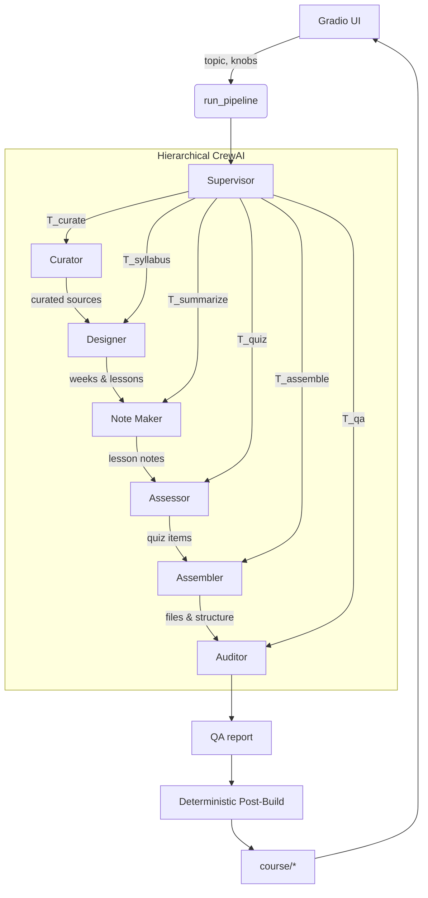

# curate2course

**Agentic E‑Learning Course Builder from Open Content**  
Generate a multi‑week course (syllabus, lessons, reading list, and quizzes) from openly licensed sources using a hierarchical CrewAI workflow and a fast local Gradio UI.

---

## ✨ What you get

- **Syllabus**: week-by-week plan derived from open sources
- **Lessons**: Markdown notes with objectives, summaries, and attributions
- **Quizzes**: MCQs + short prompts per lesson (JSON)
- **Reading list**: track sources & licenses
- **Manifest + QA**: machine-readable file inventory and license QA

Output is written under `course/` so you can zip and share immediately.

---

## 🏗️ Architecture & Workflow

This project uses a **hierarchical crew** where a **Supervisor** routes work to specialist agents. We also add a **deterministic post‑builder** to guarantee files exist even when LLM calls are rate-limited.

### High-level flow



### Agents (in `src/agents.py`)

- **Supervisor** — sets intent and routes tasks, provides consistency
- **Curator** — finds candidate open-content sources for the topic
- **Designer** — crafts the syllabus structure (weeks × lessons)
- **Note Maker** — writes concise lesson notes with objectives
- **Assessor** — generates quizzes (MCQs + short prompts)
- **Assembler** — lays out folders, filenames, and metadata
- **Auditor** — reviews licensing and structure for issues

### Tools (in `src/tools/`)

- **SearchTools** — Wikipedia/keyword seed search (local heuristic)
- **LicenseTools** — lightweight allowlist check for strings
- **TextTools** — cleaning/dedup helpers for lesson notes
- **ExportTools** — filesystem I/O (write text/JSON safely)

### Deterministic post‑build

Even if an upstream agent partially succeeds, `_deterministic_build()` synthesizes a coherent **syllabus**, **lessons**, **quizzes**, **reading list**, **manifest**, and **qa_report** so the UI always shows downloadable artifacts. This is crucial for reliability during rapid iteration.

---

## 📁 Project layout

```
curate2course/
├─ src/
│  ├─ main.py          # CLI + Gradio UI
│  ├─ crew.py          # entrypoint to run pipeline
│  ├─ workflow.py      # agent/task wiring & deterministic build
│  ├─ agents.py        # CrewAI agent definitions
│  ├─ tasks.py         # CrewAI task templates
│  ├─ tools/
│  │  ├─ search_tools.py
│  │  ├─ license_tools.py
│  │  ├─ text_tools.py
│  │  └─ export_tools.py
│  └─ config.py        # model/provider configuration
├─ .env.example        # sample environment variables
├─ requirements.txt
└─ README.md
```

> Artifacts created after a run are placed under `course/`:  
> `syllabus.md`, `syllabus.json`, `reading_list.md`, `lessons/week_i/lesson_j.md`, `quizzes/*.json`, `course_manifest.json`, `qa_report.json`.

---

## 🔧 Requirements

- Python 3.10+
- An OpenAI API key (only paid dependency you need)
- Windows, macOS, or Linux

Install dependencies:

```bash
python -m venv venv
# Windows
venv\Scripts\activate
# macOS/Linux
# source venv/bin/activate

pip install -U pip wheel
pip install -r requirements.txt
```


---

## 🔐 Environment variables

Create `.env` in the project root :

```dotenv
OPENAI_API_KEY=sk-your-key
# Optional overrides
OPENAI_MODEL=gpt-4o-mini
OPENAI_TEMPERATURE=0.2
```

---

## 🚀 Usage

### 1) Run the Gradio app (recommended for testing)

```bash
python -m src.main ui
```

Open the local URL shown in the terminal (e.g., http://127.0.0.1:7860).

- Set **Topic**, **Weeks**, **Lessons per week**, **Min resources per lesson**
- Choose license allowlist (default: CC‑BY, CC‑BY‑SA, CC0, Public Domain)
- Click **Build Course**
- Download artifacts from the **Key files / Lessons / Quizzes** tabs

### 2) CLI build

```bash
python -m src.main build \
  --topic "Object-Oriented Programming in C++ (Classes, Objects, Encapsulation)" \
  --weeks 4 \
  --lessons-per-week 2 \
  --min-resources 2 \
  --license-allowlist "CC-BY,CC-BY-SA,CC0,Public Domain"
```

This writes the same `course/` folder without the UI.

---

## ⚙️ Configuration

Models and temperature are configured in `src/config.py`. By default:

- Uses the OpenAI SDK v1, model name from `OPENAI_MODEL` (fallback sensible default)
- Temperature kept low for **determinism** in structural tasks
- You can point CrewAI to different providers if you prefer

---

## 🧪 Output schema

### `course_manifest.json`
```json
{
  "topic": "…",
  "weeks": 4,
  "lessons_per_week": 2,
  "lessons": ["lessons/week_1/lesson_1.md", "…"],
  "quizzes": ["quizzes/week_1_lesson_1.json", "…"],
  "syllabus_md": "course/syllabus.md",
  "syllabus_json": "course/syllabus.json",
  "reading_list": "course/reading_list.md",
  "licenses": ["CC-BY", "CC-BY-SA", "CC0", "Public Domain"]
}
```

### `quizzes/*.json`
```json
{
  "items": [
    {
      "type": "mcq",
      "question": "…?",
      "choices": ["A", "B", "C", "D"],
      "answer": 0,
      "rationale": "…",
      "bloom": "understand",
      "difficulty": "easy"
    },
    { "type": "short", "prompt": "…" }
  ]
}
```

---


## 🛠️ Development tips

- Agent prompts live in `src/tasks.py` and `src/agents.py`. Tighten task guidelines to change tone/length.
- For **domain-specific** courses, add custom seeders in `SearchTools`.

Run unit checks for helper utilities:
```bash
pytest -q
```


## 🗺️ Roadmap

- Richer source discovery (OpenAlex/Core/Wikidata integration)
- Rubric‑aware quiz generator and alignment to objectives
- Optional PDF/HTML export and packaging
- Human‑in‑the‑loop edits from the UI, then regenerate quizzes

---

## 📄 License

This repo’s code is under the MIT License. The **generated course content** inherits licenses from the sources you choose. Always verify `reading_list.md` and `qa_report.json` before publishing.

---

## 🙏 Acknowledgements

- Built with **CrewAI**, **Gradio**, and the **OpenAI** Python SDK.
- Thanks to the maintainers of open content platforms that make this possible.
